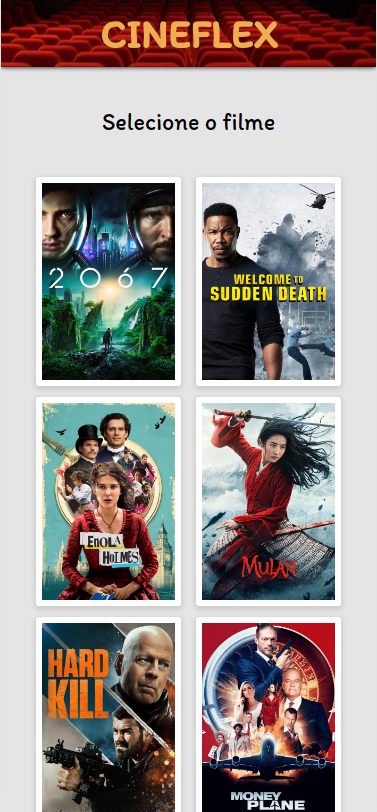
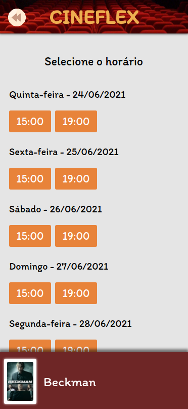
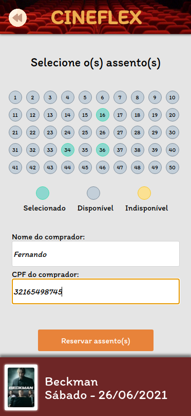
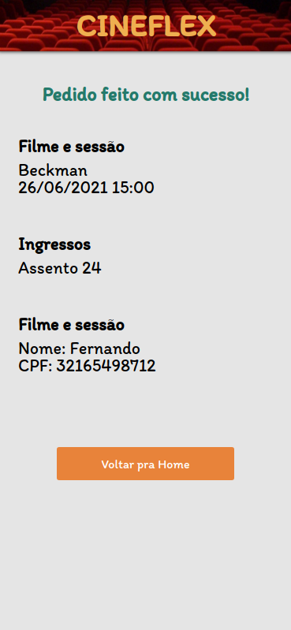

<h1 align="center">
    Cineflex
</h1>

<p align="center">
    
</p>

<h4 align="center"> 
	 Status: Delivered.
</h4>

## About

Cineflex is a quick and easy way to book movie tickets. <br>
The focus of this project is to further develop Front End skills and the concept of single-page applications, changing from pure JavaScript to React, using HTML5, CSS3 and React. <a href="https://cineflex-react-gules.vercel.app" target="_blank">Or view here!</a>

---

## Features

- [x] Mobile Layout

- [x] Homepage experience:

  - [x] Loads list of movies;
  - [x] Select any movie you like!

- [x] Movie sessions

  - [x] Displays available sessions, separated by weekdays and hour;
  - [x] Select the most convenient session for you!;

- [x] Selecting seats

  - [x] Displays seats, showing if it is available or not;
  - [x] Select how many seats you want;
  - [x] Input name and document;
  - [x] When finished, send purchase request;

- [x] Success page
  - [x] Displays success page with purchase informations;
  - [x] Back home button;

---

## Layout

The application layout is available on Figma:

<a href="https://www.figma.com/file/rc7ZTYfLZg9zpGahWB1aXb/Cineflex?node-id=0%3A1">
  
</a>

### Mobile

<p align="center">
  
  
</p>
<p align="center">
  
  
</p>

## Tech Used

The following tools were used in the construction of the project:

- **[](https://reactjs.org/)**
- **[](https://html5.org/)**
- **[](https://www.w3.org/Style/CSS/Overview.en.html)**
- **[](https://www.javascript.com/)**

#### **Utilities**

- Prototype: **[Figma](https://www.figma.com/)** → **[Protótipo (Cineflex)](https://www.figma.com/file/rc7ZTYfLZg9zpGahWB1aXb/Cineflex?node-id=0%3A1)**
- Editor: **[Visual Studio Code](https://code.visualstudio.com/)**
- Fonts: **[Roboto](https://fonts.google.com/specimen/Roboto)**, **[Itim](https://fonts.google.com/specimen/Itim)**

---

## How to run

1. Clone this repository
2. Install dependencies
```bash
npm i
```
3. Create .env file in origin and insert
```bash
REACT_APP_API_BASE_URL="https://mock-api.bootcamp.respondeai.com.br/api/v2/cineflex"
```
4. Run the front-end with
```bash
npm start
```

## Authors

<p>
<a style="border-radius: 50px;" width="100px;" href="https://github.com/fevalani">
 
 <br />
 <sub><b>Fernando Valani</b></sub></a>
 <br />

## </p>

## License

👋🏽 Get in Touch!

---
